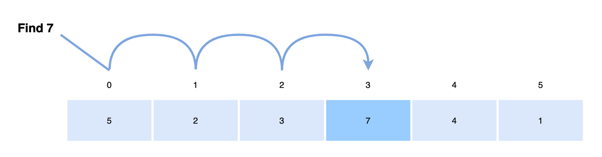
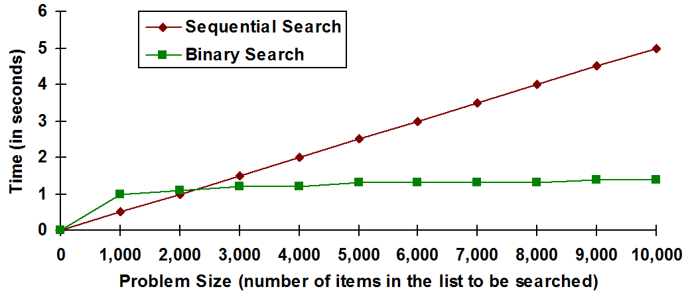
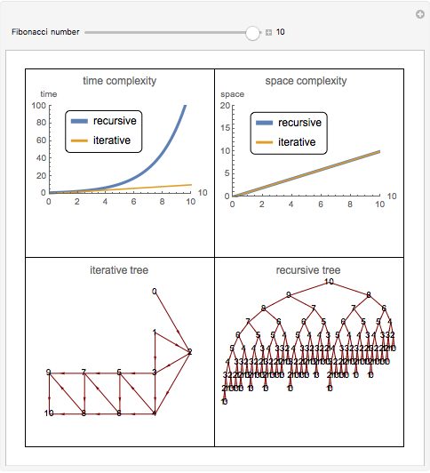

# 📌Definition of Algoritms
### • **Algorithm** : a step-by-step procedure for producing the solution to each problem instance
    ex) sequential search algorithm

# 📌The Importance of Developing Efficient Algorithms 
## 🔎Sequential Search Algorithm
- One of the algorithms to find a particular value in a list.
- 데이터 배열의 처음부터 끝까지 차례대로 비교하여 목표 데이터를 찾는다.

```
void SeqSearch(int n, const keyType S[], keyType x, index& location){
    location = 1;
    while (location <= n && S[location] != x)
        location++;
    if (location > n)
        location = 0;
}
```


## 🔎Binary Search Algorithm
- 오름차순으로 정렬된 리스트에서 목표 데이터의 위치를 찾는 알고리즘.
```
void BinSearch(int n, const keyType S[], keyType x, index& location){
    index low, high, mid;

    low = 1; high = n; location = 0;
    while (low <= high && location == 0){
        mid = floor((low+high)/2);
        if(x==S[mid])
            location = mid;
        else if(x<S[mid])
            high = mid - 1;
        else
            low = mid + 1;
    }
}
```
## 🔎Sequential Search vs Binary Search 

- 데이터의 사이즈가 커질수록, 순차탐색의 경우 수행되는 단계는 데이터 사이즈에 비례하여 증가한다.
- 이진탐색의 경우 그보다 현저히 낮은 수준에서 탐색이 가능하다.

> **따라서 경우에 따라 효율적인 알고리즘을 선택해야한다.**

## 🔎Recursive Algorithm in Fibonacci Sequence
```
int Fib(int n){
    if(n<=1)
        return n;
    else
        return Fib(n-1) + Fib(n-2);
} 
```

- T(n)을 Fib(n) 트리의 총 항개수라고 할때, 

>T(n) > 2 * T(n-2) > 2 * 2 * T(n-4) > 2 * 2 * 2 * T(n-6) ... > 2 * 2 * 2 * 2 * T(0) = 2^n/2

> **T(n) >= 2^n/2**

## 🔎Iterative Algorithm in Fibonacci Sequence
```
int Fib(int n){
    index i; int f[0,n];

    f[0] = 0;
    if(n>0){
        f[1] = 1;
        for(i=2; i<=n; i++)
            f[i] = f[i-1] + f[i-2];
    }
    return f[n];
}
```
> 이 경우, **T(n) = n + 1** 이다.

## 🔎Recursive vs Iterative


# 📌Complexity Analysis of Algorithm
## 1. the input size
- size of array, single number, number of verticles and number of edges(for graph)
## 2. the basic operation
## 🔎Time Complexity Analysis
- The determination of how many times the basic operation is done for each value of the input size